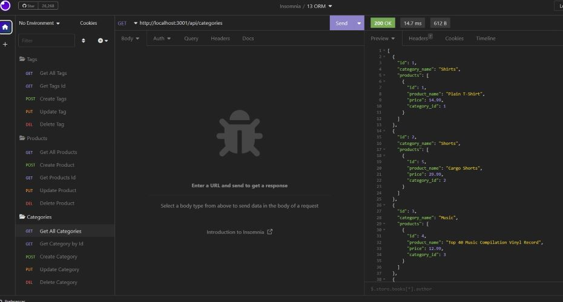
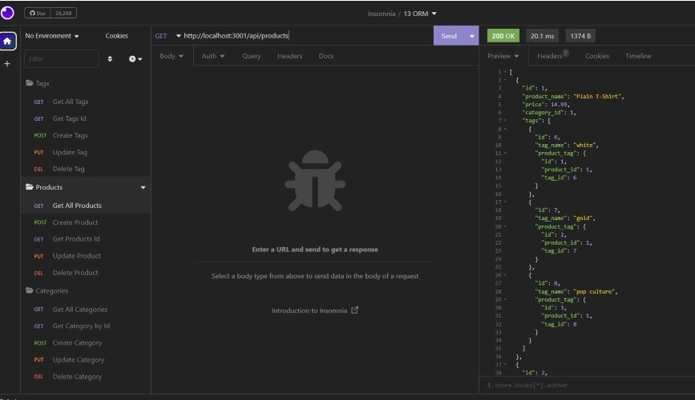
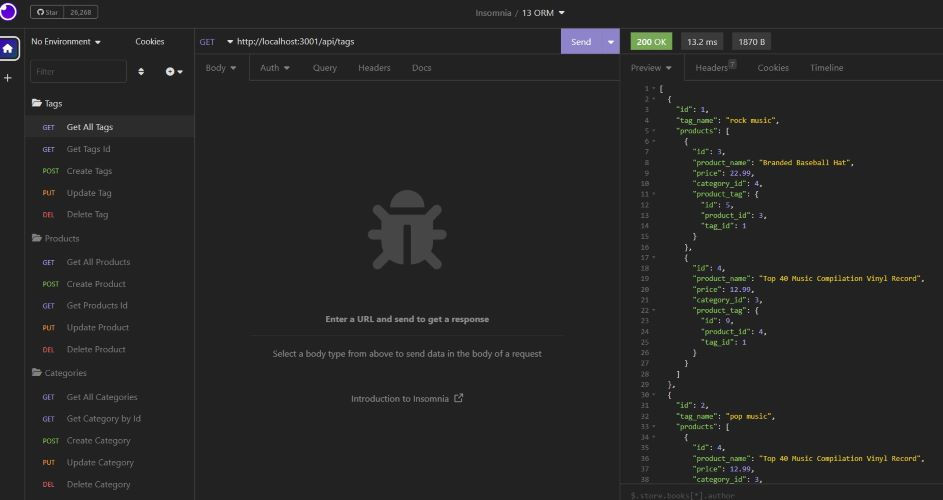

# ORM-E-Commerce-

## Table of Contents
- [Description](#description)
- [Visuals](#visuals)
- [Links](#links)

***

## Description
Given starter code the task for this challenge is to build the back end for an e-commerce site by modifying starter code. 

You’ll configure a working Express.js API to use Sequelize to interact with a MySQL database. 

E-Commerce is the largest sector of the electronics industry, generating an estimated $29 trillion in 2019. 

E-commerce platforms like Shopify and WooCommerce provide a suite of services to businesses of all sizes. 

Due to their prevalence, understanding the fundamental architecture of these platforms will benefit you as 

a full-stack web developer.
***

## Visuals
Categories

Products

Tags

***

## Links
Link to GitHub: [ORM-E-Commerce](https://github.com/KMPhillips20/ORM-E-Commerce-)

Link to walkthrough video: [Walkthrough-Video](https://drive.google.com/file/d/1cLBnK1ytBQgQfRCiS03_5WbH4FkZTBYe/view)
***